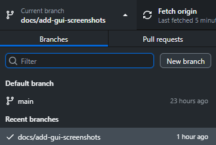
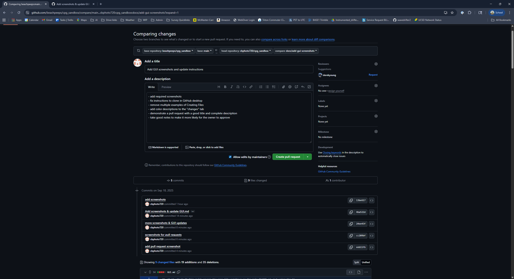

# Git Training with GitHub Desktop

This guide covers the same Git workflows as the main README.md, but using the **GitHub Desktop** graphical user interface instead of command line. GitHub Desktop provides a user-friendly way to manage Git repositories without needing to memorize commands.

## Table of Contents

1. [Installing and Setting Up GitHub Desktop](#installing-and-setting-up-github-desktop)
2. [Cloning the Repository](#cloning-the-repository)
3. [Understanding the GitHub Desktop Interface](#understanding-the-github-desktop-interface)
4. [Checking Your Current Branch](#checking-your-current-branch)
5. [Understanding Branches (GUI Context)](#understanding-branches-gui-context)
6. [Creating a New Branch](#creating-a-new-branch)
7. [Making Code Changes](#making-code-changes)
8. [Committing Changes](#committing-changes)
9. [Pushing Changes to GitHub](#pushing-changes-to-github)
10. [Creating a Pull Request](#creating-a-pull-request)
11. [Useful GitHub Desktop Features](#useful-github-desktop-features)

## Installing and Setting Up GitHub Desktop

### 1. Download and Install

1. Go to [desktop.github.com](https://desktop.github.com)
2. Download GitHub Desktop for your operating system
3. Install the application following the setup wizard
4. Sign in with your GitHub account when prompted

### 2. Configure Git Settings

1. Go to **File** → **Options** (Windows) or **GitHub Desktop** → **Preferences** (Mac)
2. In the **Git** tab, ensure your name and email are set correctly
3. These should match your GitHub account information

## Cloning the Repository

### Method 1: Clone from GitHub.com

1. Go to your repository on GitHub.com
2. Click the green **"Code"** button
3. Select **"Open with GitHub Desktop"**
4. Choose where to save the repository on your computer
5. Click **"Clone"**

### Method 2: Clone from GitHub Desktop

1. Open GitHub Desktop
2. Click **"Current Repository"** (top left)
3. click add → clone repositroy...
3. Go to the **"GitHub.com"** tab
4. Find your repository in the list
5. Choose the local path where you want to save it
6. Click **"Clone"**


## Understanding the GitHub Desktop Interface

### Main Interface Components

When you open GitHub Desktop, you'll see several key areas:

1. **Repository Selector** (top left): Shows current repository and allows switching
2. **Branch Selector** (top center): Shows current branch with dropdown to switch
3. **Changes Tab**: Shows files you've modified, added, or deleted
4. **History Tab**: Shows commit history for the current branch
5. **Commit Message Box**: Where you write commit messages
6. **Commit Button**: To commit your changes
7. **Push/Pull Buttons**: To sync with GitHub


### Navigation Tabs

- **Changes**: View and stage files for commit
- **History**: Browse commit history and see what changed
- **Repository Settings**: Configure repository options

## Checking Your Current Branch

### Visual Indicators

1. **Branch Name**: Look at the top center of the interface - the current branch name is displayed.  (at this point, you will be on the main branch)
2. **Branch Dropdown**: Click the branch name to see all available branches
3. **Status Bar**: The bottom of the interface shows current branch and sync status



### Branch Information

- Current branch is always visible in the top center
- Checkmark indicates the branch is up to date with remote

## Understanding Branches (GUI Context)

### What You'll See in GitHub Desktop

- **Branch List**: All branches are visible in the branch dropdown
- **Branch Visualization**: The History tab shows how branches diverge and merge
- **Branch Status**: Visual indicators show which branches are ahead/behind

### Branch Types in the Interface

1. **Local Branches**: Branches that exist only on your computer
2. **Remote Branches**: Branches that exist on GitHub (shown with "origin/" prefix)
3. **Current Branch**: Highlighted in the branch selector

## Creating a New Branch

### Method 1: Using the Branch Menu

1. Click on the current branch name in the top center
2. Click **"New branch"** at the bottom of the dropdown
3. Enter a descriptive branch name (see naming conventions below)
4. Choose which branch to base it on (usually `main`)
5. Click **"Create branch"**

### Method 2: Using the Menu Bar

1. Go to **Branch** → **New branch**
2. Enter your branch name
3. Select the base branch
4. Click **"Create branch"**

### Branch Naming Conventions (Same as CLI)

Use the same naming patterns as the command line version:

```bash
# Feature branches
feature/add-user-authentication
feature/implement-search-functionality

# Bug fix branches
bugfix/fix-login-error
bugfix/resolve-memory-leak

# Other patterns
chore/update-dependencies
docs/add-api-documentation
```

## Making Code Changes

### Creating Files
1. Right click your repository in GitHub Desktop
2. Click "Show in Explorer"
4. Create new files as needed to stage changes on your branch


### Example Files to Create

Create the same example files as in the CLI version:

**hello_world.py**:
```python
#!/usr/bin/env python3
"""
A simple hello world script for Git training.
"""

def main():
    print("Hello, Git World!")
    print("This is a training exercise.")

if __name__ == "__main__":
    main()
```

**calculator.js**:
```javascript
// Simple calculator for Git training
function add(a, b) {
    return a + b;
}

function subtract(a, b) {
    return a - b;
}

function multiply(a, b) {
    return a * b;
}

function divide(a, b) {
    if (b === 0) {
        throw new Error("Division by zero is not allowed");
    }
    return a / b;
}

// Example usage
console.log("Calculator functions loaded!");
console.log("2 + 3 =", add(2, 3));
console.log("10 - 4 =", subtract(10, 4));
```

## Committing Changes

### 1. View Your Changes

1. Switch to the **"Changes"** tab in GitHub Desktop
2. You'll see all modified (yellow), added (green), and deleted (red) files
3. Click on any file to see a diff view of what changed


### 2. Stage Files for Commit

#### Stage Individual Files
1. Check the box next to each file you want to include in the commit
2. Unchecked files will not be committed

#### Stage All Changes
1. Check the box at the top to select all changes
2. Or use **Ctrl+A** (Windows) / **Cmd+A** (Mac)

### 3. Write a Commit Message

1. In the commit message box at the bottom, write a descriptive message
2. Use the same format as CLI: "Add hello world Python script and calculator JavaScript functions"
3. Optionally add a longer description in the extended description field

### 4. Commit Your Changes

1. Click the **"Commit to [branch-name]"** button
2. Your changes are now committed to your local branch

### 5. (Optional) View Your Commit

1. Switch to the **"History"** tab
2. You'll see your new commit at the top
3. Click on the commit to see the details and file changes

## Pushing Changes to GitHub

### 1. Push Your Branch

1. After committing, you'll see a **"Push origin"** button in the top right
2. Click **"Push origin"** to upload your branch to GitHub
3. If this is a new branch, GitHub Desktop will automatically set up the upstream


### 2. Verify the Push

1. The push button will disappear once successful
2. You'll see a green checkmark indicating the branch is up to date
3. Switch to the **"History"** tab to confirm your commits are there

### 3. View on GitHub

1. Right click your repository → **"View on GitHub"** to open your repository in a web browser
2. You can see your new branch and commits on GitHub.com


## Creating a Pull Request

### Method 1: From GitHub Desktop

1. After pushing your branch, you'll see a **"Preview Pull Request"** button in the main window
2. Click the button to open GitHub.com in your browser
3. The pull request form will be pre-filled with your branch information

### Method 2: From GitHub.com

1. Go to your repository on GitHub.com
2. You'll see a banner suggesting to create a pull request for your recently pushed branch
3. Click **"Compare & pull request"**

### Fill Out the Pull Request

1. **Title**: Use a clear, descriptive title
2. **Description**: Explain what changes you made and why
3. **Reviewers**: Assign reviewers if needed
4. **Labels**: Add appropriate labels
5. **Milestone**: Set a milestone if applicable



### Submit the Pull Request

1. Review all the information
2. Click **"Create pull request"**
3. Your pull request is now submitted for review

## Useful GitHub Desktop Features

### Repository Management

#### Switching Repositories
1. Click the repository name in the top left
2. Select from your list of repositories
3. Or click **"Add"** to clone a new repository

#### Repository Settings
1. Go to **Repository** → **Repository Settings**
2. Configure remote URLs, ignored files, and other options

### Branch Management

#### Viewing All Branches
1. Click the branch dropdown
2. See all local and remote branches
3. Switch between branches easily

#### Deleting Branches
1. Right-click on a branch in the dropdown
2. Select **"Delete [branch-name]"**
3. Confirm the deletion

### History and Comparison

#### Viewing Commit History
1. Go to the **"History"** tab
2. Click on any commit to see what changed
3. Compare different commits or branches

#### Branch Comparison
1. In the History tab, select two commits or branches
2. See a side-by-side comparison of changes


### Synchronization

#### Pulling Changes
1. Click **"Fetch origin"** to check for updates
2. If there are new changes, click **"Pull origin"** to download them
3. Resolve any merge conflicts if they occur

#### Merge Conflicts
1. GitHub Desktop will highlight conflicted files
2. Use the built-in merge tool or your preferred editor
3. Mark conflicts as resolved when done

*Screenshot needed: Merge conflict resolution interface*

## Keyboard Shortcuts

### Common Shortcuts

- **Ctrl+Shift+N** (Windows) / **Cmd+Shift+N** (Mac): Clone repository
- **Ctrl+N** (Windows) / **Cmd+N** (Mac): New repository
- **Ctrl+Shift+P** (Windows) / **Cmd+Shift+P** (Mac): Push to origin
- **Ctrl+Shift+O** (Windows) / **Cmd+Shift+O** (Mac): Pull from origin
- **Ctrl+1** (Windows) / **Cmd+1** (Mac): Switch to Changes tab
- **Ctrl+2** (Windows) / **Cmd+2** (Mac): Switch to History tab

## Troubleshooting

### Common Issues

#### Repository Not Showing Changes
1. Make sure you're in the correct repository
2. Check that files are saved in your editor
3. Refresh the Changes tab

#### Push Fails
1. Check your internet connection
2. Verify you're signed in to GitHub
3. Make sure you have push permissions to the repository

#### Merge Conflicts
1. GitHub Desktop will guide you through conflict resolution
2. Use the built-in merge tool or your preferred editor
3. Don't forget to mark conflicts as resolved

### Getting Help

1. **Help Menu**: Go to **Help** → **Show User Guide**
2. **GitHub Documentation**: Visit [docs.github.com](https://docs.github.com)
3. **Community Support**: Check GitHub Community Forums

## Best Practices for GitHub Desktop

1. **Regular Syncing**: Pull changes frequently to stay up to date
2. **Descriptive Commits**: Write clear commit messages
3. **Small Commits**: Make focused, logical commits
4. **Branch Naming**: Use consistent naming conventions
5. **Review Changes**: Always review your changes before committing
6. **Backup Work**: Push your branches regularly to avoid losing work

## Comparison: CLI vs GitHub Desktop

| Task | Command Line | GitHub Desktop |
|------|-------------|----------------|
| Clone repository | `git clone <url>` | Clone button in interface |
| Create branch | `git checkout -b <name>` | Branch → New branch |
| Check status | `git status` | Changes tab |
| Stage files | `git add <file>` | Checkboxes in Changes tab |
| Commit | `git commit -m "message"` | Commit message + Commit button |
| Push | `git push origin <branch>` | Push origin button |
| Pull | `git pull origin main` | Pull origin button |
| View history | `git log` | History tab |

Both methods achieve the same results - choose the one that feels most comfortable for your workflow!

---

*Note: Screenshots referenced in this guide would be helpful additions. Consider taking screenshots of your own GitHub Desktop interface to create a complete visual guide.*
